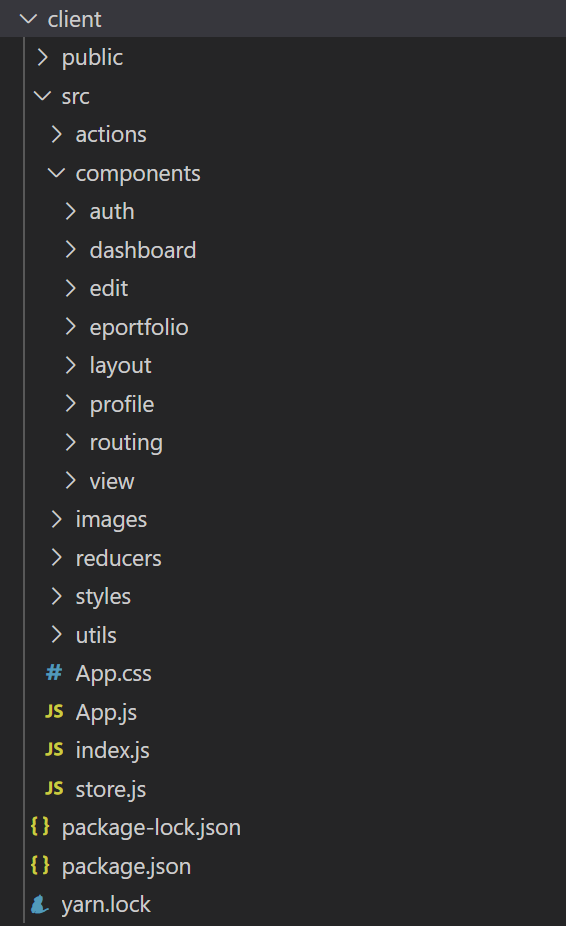
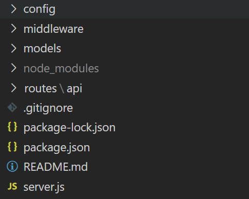

# Quaranteam Documentation  
## Table of contents  
- [User Documentation](#user-documentation)  
  - [About Us](#about-us)  
  - [Features](#features)  
  - [Design](#design)  
- [Frontend Documentation](#frontend-documentation)  
  - [Setup](#setup)  
  - [Technologies](#technologies)  
  - [Dependencies](#dependencies) 
  - [Frontend Structure](#frontend-structure)  
  - [Frontend Routes](#frontend-routes)  
- [Backend Documentation](#backend-documentation)  
  - [Setup](#setup)  
  - [Technologies](#technologies) 
  - [Dependencies](#dependencies)
  - [Backend Structure](#backend-structure)  
  - [Backend API Documentation](#backend-api-documentation) 
  
               
# User Documentation  
https://winnie76.github.io/Quaranteam/  
## About Us  
Qauranteam ePortfolio Platform helps create highly customisable ePortfolios for every purpose.   
    
## Features  
### Google Authentication
Google authentication was used for the convenience of users.   
With existing account, users don't need to walk through the process of registration.  

### Dashboard
Users could access the dashboard after login.   
The dashboard contains all existing ePortfolios and users' favourite ePortfolios made by others.  
    
### Create ePortfolios & templates available
In the dashboard, users have the option to create new ePortfolios by clicking '+' sign.  
We provide several templates for the convenience of users. In addition to that, a completely blank templates is available if users prefer designing their own ePortfolios.   
   
### Edit ePortfolios
Each ePortfolio contains lots of items. Users could edit each items using tools available in the sidebar. Texts, images, links....could be put in the items.  to be continue.....  
   
### Save favourite ePortfolios
not available yet...

### Share ePortfolio links
By clicking 'get link' from each ePortfolio in the dashboard, users could share their ePortfolios with others.  
## Design  
Material UI was used to facilitate the design of interface.  
The purpose of design is to make Quanranteam App look professional and easy to use.  
to be continue...
  
  
# Frontend Documentation  
## Setup  
1.cd client   
2.npm install (automatically install all dependencies from client/package.json)   


**How to run both server and client:**
1. go out of client folder by "cd .."  
   (make sure you are at root folder)   
2. do "npm run dev"   

  
## Technologies  
React & Redux   
  
## Dependencies  
```javascript
"dependencies": {
    "@material-ui/core": "^4.11.0",
    "@material-ui/icons": "^4.9.1",
    "axios": "^0.20.0",
    "faker": "^5.1.0",
    "firebase": "^7.21.1",
    "firebaseui": "^4.6.1",
    "moment": "^2.24.0",
    "react": "^16.13.0",
    "react-dom": "^16.13.0",
    "react-firebaseui": "^4.1.0",
    "react-hook-form": "^6.8.6",
    "react-moment": "^0.9.7",
    "react-redux": "^7.2.0",
    "react-redux-firebase": "^3.7.0",
    "react-router-dom": "^5.1.2",
    "react-scripts": "^3.4.3",
    "redux": "^4.0.5",
    "redux-devtools-extension": "^2.13.8",
    "redux-thunk": "^2.3.0",
    "uuid": "^7.0.2"
  }
  ```
## Frontend Structure  
<p align="left">	
  	
</p>  

## Frontend Routes
http://localhost:3000/home   
http://localhost:3000/dashboard   
http://localhost:3000/eportfolio   
http://localhost:3000/eportfolio/page
TBA.....
  
  
   
# Backend Documentation  
## Setup  
1. Download Node.js  
2. Download Postman (to make requests to backend for testing)  
3. npm install

**How to run both server and client:**
1. go out of client folder by "cd .."  
   (make sure you are at root folder)   
2. do "npm run dev"    

## Technologies  
Express

## Dependencies
```json
 "dependencies": {
    "axios": "^0.19.2",
    "bcryptjs": "^2.4.3",
    "client": "file:client",
    "config": "^3.3.1",
    "cors": "^2.8.5",
    "express": "^4.17.1",
    "express-validator": "^6.6.1",
    "firebase-admin": "^9.2.0",
    "gravatar": "^1.8.0",
    "jsonwebtoken": "^8.5.1",
    "mongoose": "^5.10.3",
    "normalize-url": "^5.0.0",
    "puppeteer": "^5.3.0",
    "react": "^16.13.1",
    "react-router-dom": "^5.2.0",
    "tough-cookie": "^4.0.0"
  }
  ```
## Backend Structure  
<p align="left">	
  	
</p>  

## Backend API Documentation  
https://documenter.getpostman.com/view/12626526/TVK5cgbD   


